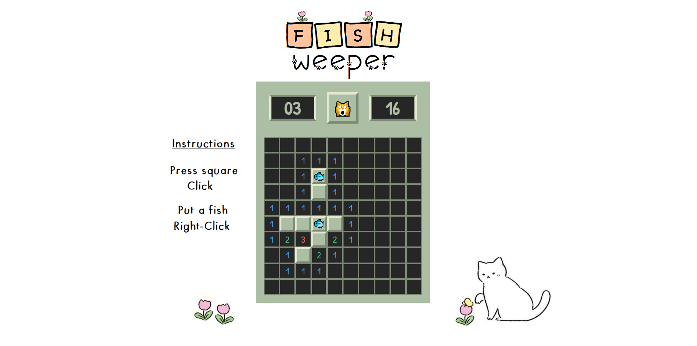

# Fish Weeper

_Videojuego del clásico Buscaminas realizado en JavaScript_

## Link del proyecto 🚀

_[Fish Weeper](https://fishweeper.netlify.app)_

## Instrucciones ⚙️

_Click_: Presionar un cuadrado

_Click Derecho_: Poner un pez

## Autor ✒️

**Luis Correa** - *Desarrollo del videojuego* - [GitHub](https://github.com/luisCorreaCespedes)

## Expresiones de Gratitud 🎁

* Si les gusta el proyecto pongan su ⭐️
* Mini juego hecho para todos los que toman café ☕ al programar. 
* Gracias a todos mis amigos por apoyarme a crear videojuegos aunque sean simples 🤓.

